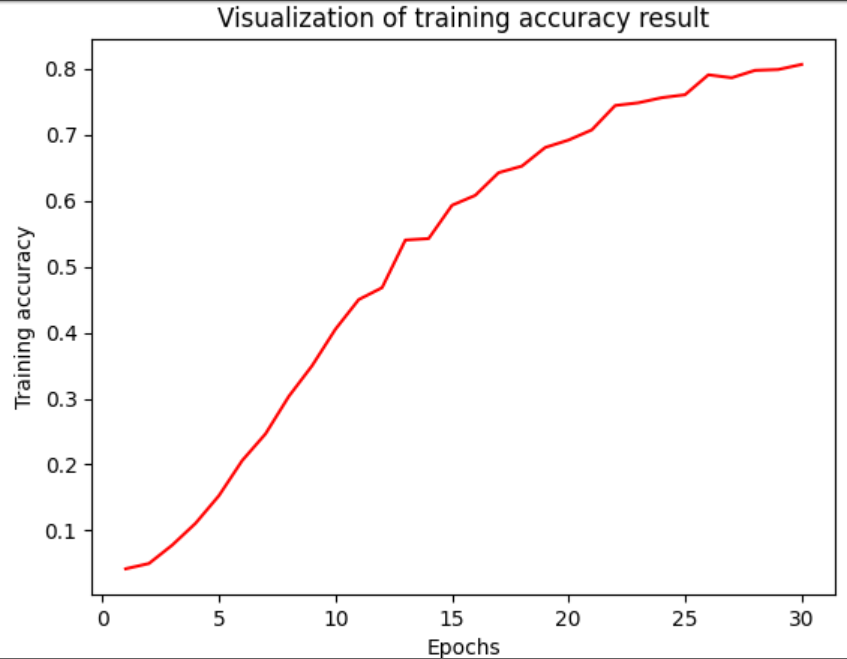

# Fruit and Vegetable Image Classification
This project is a deep learning-based image recognition system built using TensorFlow and Keras to classify images of fruits and vegetables into 36 categories.  
It demonstrates an end-to-end workflow from dataset preparation to model training, evaluation, and prediction.

---

## Project Overview
The project focuses on building a Convolutional Neural Network (CNN) that can accurately recognize and classify fruit and vegetable images.  
The model was trained on a dataset downloaded from Kaggle, containing separate folders for training, validation, and testing.

---

## Dataset
- Source: Kaggle Fruit and Vegetable Image Classification Dataset  
- Folder Structure:

- Total Classes: 36  
- Dataset Size: ~2 GB  

Note: The dataset is not uploaded to GitHub because of its size (ignored using .gitignore).

---

## Technologies Used
- Language: Python  
- Libraries:
- TensorFlow / Keras  
- NumPy  
- Matplotlib  
- Jupyter Notebook  

---

## Model Architecture
The CNN model was built using TensorFlow Keras API with the following layers:

```python
model = Sequential([
  Rescaling(1./255, input_shape=(64, 64, 3)),
  Conv2D(32, (3,3), activation='relu'),
  MaxPooling2D(2,2),
  Conv2D(64, (3,3), activation='relu'),
  MaxPooling2D(2,2),
  Flatten(),
  Dense(128, activation='relu'),
  Dense(36, activation='softmax')
])

```
## Prediction Example
```
import numpy as np
from tensorflow.keras.preprocessing import image

img = image.load_img("sample_image.jpg", target_size=(64, 64))
img_array = image.img_to_array(img)
img_array = np.expand_dims(img_array, axis=0)

prediction = model.predict(img_array)
predicted_class = np.argmax(prediction[0])
print("Predicted Class:", class_names[predicted_class])
```

## Output Example
```
Predicted Class: Tomato
```

## Visualization
Training and validation accuracy/loss were plotted using Matplotlib to monitor model performance.
```
plt.plot(history.history['accuracy'], label='train_accuracy')
plt.plot(history.history['val_accuracy'], label='val_accuracy')
plt.legend()
plt.title("Model Accuracy")
plt.xlabel("Epochs")
plt.ylabel("Accuracy")
plt.show()
```

## Project Structure
```
fruit-veg-image-classification/
│
├── data/
│   ├── train/
│   ├── validation/
│   └── test/
│
├── model/
│   └── fruit_veg_model.h5
│
├── fruit_veg_classification.ipynb
├── requirements.txt
├── .gitignore
└── README.md
```

## Future Improvements

Add transfer learning (e.g., VGG16, ResNet50)
Build a Flask or Streamlit web app for live predictions
Deploy model using TensorFlow Lite for mobile devices

## Model Accuracy Graph

The training and validation accuracy during model training:

